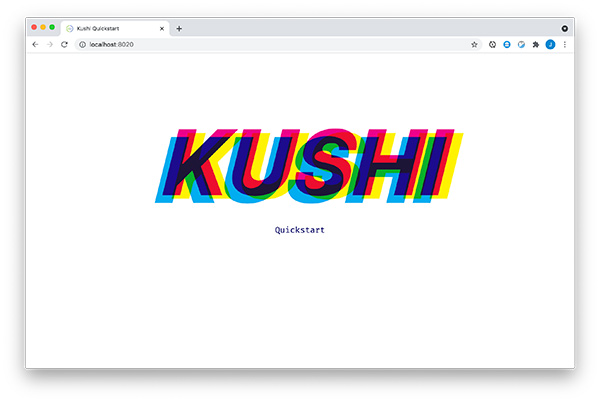

# kushi : quickstart 
[kushi](https://github.com/paintparty/kushi) is a complete styling solution for ClojureScript.

This template demonstrates how to setup a project with kushi, using [shadow-cljs](https://github.com/thheller/shadow-cljs) and [Reagent](https://reagent-project.github.io/). You can find most of the documentation and examples that you need to get started via comments in the main file at `src/main/starter/browser.cljs`

This template is based on [shadow-cljs/browser-quickstart](https://github.com/shadow-cljs/quickstart-browser).

<br>

## Required Software

- [node.js (v6.0.0+)](https://nodejs.org/en/download/)
- [Java JDK (8+)](http://www.oracle.com/technetwork/java/javase/downloads/index.html) or [Open JDK (8+)](http://jdk.java.net/10/)


<br>

## Running the Example

```bash
git clone https://github.com/paintparty/kushi-quickstart.git kushi-quickstart
cd kushi-quickstart
npm install
npx shadow-cljs watch app
```

This will begin the compilation of the configured `:app` build and re-compile whenever you change a file.

When you see a "Build completed." message your build is ready to be used.

<pre lang="txt">
<code>[:app] Compiling ...

<b>kushi v0.1.4</b>

Writing: public/css/kushi.css ...

1 @font-face rules
2 @keyframes rules
7 defclasses
7 classes

[:app] Build completed. (163 files, 3 compiled, 0 warnings
</code>
</pre>


NOTE: If, instead of the above, you see the following:
```txt
Writing: public/css/kushi.css ...

0 unique classes
```

Leave your build running and open `src/main/starter/browser.cljs` in your editor, then re-save it.

You can view this app at  [http://localhost:8020](http://localhost:8020). You should see a webpage with animated headline and byline that looks like the screenshot below. If you don't then try to resave the `browser.cljs` as per the suggestion above.



<br>
<br>
<br>
<br>

The app is only a very basic skeleton with the most useful development tools configured.

Please see [shadow-cljs/browser-quickstart](https://github.com/shadow-cljs/quickstart-browser) for more detailed info `shadow-cljs`-specific configuration options.

<br>

## Manual Setup Details
If you were to setup kushi manually, starting with the base [shadow-cljs template](https://github.com/shadow-cljs/quickstart-browser), you would follow these 3 steps:

#### 1) Add dependency, build hooks, and build-options in `shadow-cljs.edn`
```Clojure
;; shadow-cljs configuration

{:source-paths
 ["src/dev"
  "src/main"
  "src/test"]

 :dependencies
 [[reagent "1.0.0"]
  [org.clojars.paintparty/kushi "0.1.4"] ; kushi dependency
  [binaryage/devtools "1.0.3"]]

 :dev-http
 {8020 "public"}

 :builds
 {:app
  {:target :browser
   :build-hooks [(kushi.core/kushi-debug)
                 (kushi.stylesheet/create-css-file)] ; kushi build hooks
   :build-options  {:cache-level :off} ; Setting {:cache-level :off} is required for `release` builds with kushi. See readme for details & options.
   :devtools {:preloads [starter.shared-styles]} ; Optionally preload your project's namespace that contains shared styles defined with kushi.core/defclass.
   :output-dir "public/js"
   :asset-path "/js"

   :modules
   {:main
    {:init-fn starter.browser/init}}}}}
```
<br>

#### 2) Create a `kushi.edn` at your project's root

```Clojure
;; This is a map with, at minimum, a `:css-dir` entry.
;; This must be relative to project root e.g "public/css" or "resources/public/css".
;; Please see the provided kushi.edn file for additional options.

{:css-dir "public/css"}
```
<br>

#### 3) Add the required `<link>` and `<style>` tag to your `index.html`
```html
<!-- The two tags with comments above them must be included for kushi to work. -->

<!DOCTYPE html>
<html lang="en">
<head>
  <meta charset="UTF-8">
  <meta http-equiv="X-UA-Compatible" content="IE=edge">
  <meta name="viewport" content="width=device-width, initial-scale=1.0">
  <!---
    The value of the `href` in the link tag below needs to jive with your kushi.edn config file.
    At minimum, you must specify a value for :static-css-dir in your kushi.edn.
    You can optionally specify a value for :css-filename.
    The default value for :css-filename will be `kushi.css`.
  -->
  <link rel="stylesheet" href="./css/kushi.css" type="text/css">

  <!--- Include this tag for zippy hot-reload previews when developing -->
  <style type="text/css" id="_kushi-dev_"></style>

  <title>Kushi Quickstart</title>
</head>
<body>
  <noscript>You need to enable JavaScript to run this app.</noscript>
  <div id="app"></div>
  <script src="./js/main.js"></script>
</body>
</html>
```

<br>

Please see `src/main/starter/browser.cljs` and `src/main/starter/shared_styles.cljs` for details on requiring and using various kushi functionality.
